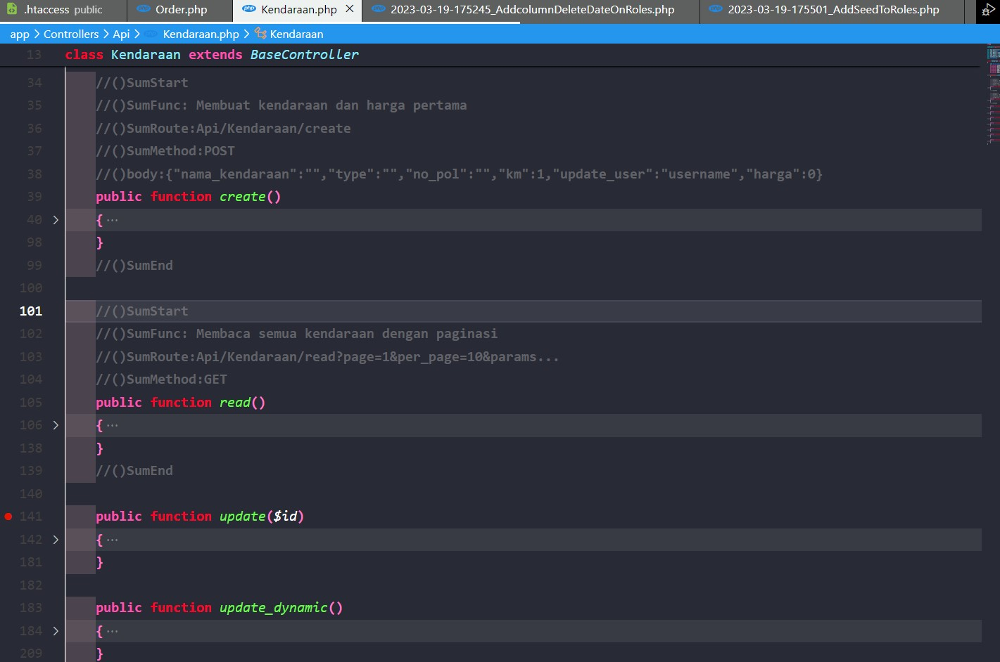
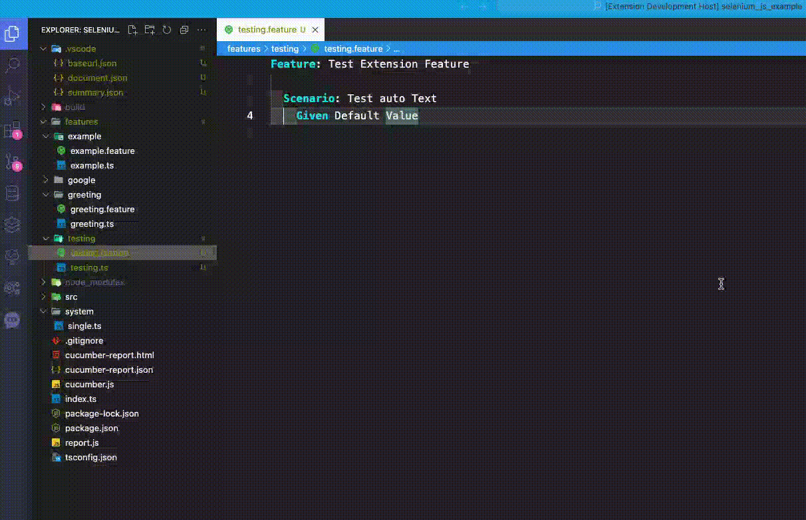

# document-summary README

This is the README for extension "document-summary".

Progress On Update
- Generating Pretty Document
- Generate Test with Jest+Axios
- Add Page with console prompt
- Dragable document list

## Features

1. Scan Summary that result webpage contain function summary code

- //()SumStart
  Buat diawal kode
- //()SumFunc: Nama Fungsi => Wajib unique
- //()SumRoute: routeFungsi
- //()SumMethod:
  GET/POST/DELETE/PUT
- //()after:
  ["assign","assignall","dll"]
- //()before:
  ["fungsi"]
- //()desc: "Gunakan ini untuk deskripsi pada fungsi"
- //()code: "Gunakan ini diantara code yang ingin ditampilkan di deskripsi kode"
- //()SumEnd
  Buat diakhir kode

  Multiline Code and optional
- ()resCode:
- ()reqBody:
- ()reqParam:
```
//()SumStart
//()SumFunc:
//()SumRoute:
//()SumMethod:
//()desc:
//()SumEnd
//()code:
```

Multiline Code like ()resCode: ()reqBody: and ()reqBody: using multiline comment operator
```
/*
()resCode:
        {
          "200": {
            "description": "List of posts",
            "content": {
              "application/json": {
                "example": [
                  {
                    "userId": 1,
                    "id": 1,
                    "title": "sunt aut facere repellat provident occaecati excepturi optio reprehenderit",
                    "body": "quia et suscipit\nsuscipit"
                  },
                  {
                    "userId": 1,
                    "id": 2,
                    "title": "qui est esse",
                    "body": "est rerum tempore quis soluta deleniti quidem"
                  }
                ]
              }
            },
            "expected":{
               "userId": 1,
               "id": 2,
               "title": "qui est esse",
               "body": "est rerum tempore quis soluta deleniti quidem"
            }
          }
        }
()resCode:

()reqParam:
        [
          {
            "name": "id",
            "in": "path",
            "description": "Post ID",
            "required": true,
            "schema": {
              "type": "integer"
            }
          }
        ]
()reqParam:

()reqBody:
        {
          "content": {
            "application/json": {
              "schema": {
                "type": "object",
                "properties": {
                  "userId": {
                    "type": "integer",
                    "description": "User ID"
                  },
                  "title": {
                    "type": "string",
                    "description": "Title of the post"
                  },
                  "body": {
                    "type": "string",
                    "description": "Content of the post"
                  }
                }
              }
            }
          }
        }
()reqBody:
*/
```
Preview Image Generate Document And Test (Swagger Based)


Preview Usage Gherkin Generator (Typescript Based)



